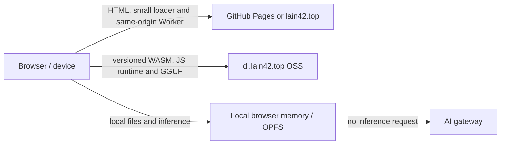

# ADR: deliver usable browser tools with OSS-hosted WASM

**Status:** Accepted — 2026-09-28

## Context

The WASM catalog contained research links and benchmark pages, while several advertised tool pages failed to load their runtime. Large runtime downloads also should not consume the website application's bandwidth. Browser security additionally prevents a cross-origin Worker script from being started directly from the OSS domain.

## Decision

Keep each tool's page and small worker bootstrap on the static site origin. Store large, version-pinned WASM runtimes and model files in Aliyun OSS at `dl.lain42.top`; browsers fetch them directly with an explicit CORS allowlist. The page gives the browser-created blob URLs to each runtime where required. User files stay in the browser. The local chat page downloads a real GGUF model and runs Wllama WASM on the user's device; a matrix microbenchmark is labeled as a separate experiment.

## Options considered

| Option | Benefit | Cost / risk | Result |
| --- | --- | --- | --- |
| Serve all page assets through the application server | One origin, simple browser loading | Large compiler/model downloads consume app-server bandwidth and disk | Rejected |
| Serve pages and small worker loaders from static hosting; fetch large WASM/models directly from OSS | Avoids application-server transfer for large assets; versioned immutable URLs | Requires correct CORS, MIME types, and same-origin Worker bootstraps | Chosen |
| Rebuild every tool into a unified WASM shell | Potentially uniform UX | Multi-tool build and compatibility work; does not solve hosting cost by itself | Deferred |

## Consequences and risks

- Application bandwidth only serves pages and small loaders; heavy kernels and model weights use the OSS endpoint.
- Cross-origin fetches depend on the OSS CORS allowlist and correct MIME/range headers.
- Some browser runtimes require a same-origin Worker script. The FFmpeg loader and worker chunk therefore remain small static-site files while FFmpeg core JS/WASM come from OSS.
- Local inference costs the user's download, storage, memory, and CPU. It is not a substitute for the online model gateway and is presented as on-device inference.
- Offline use is only promised after all required page/runtime/model assets are available in that browser's cache; a downloaded model alone does not guarantee cached runtimes.

## Validation

- `node --test tests/*.test.mjs` checks version-pinned OSS URLs, local GGUF inference wiring, and that the catalog only lists runnable tools.
- Browser smoke tests must load each WASM page from OSS and complete one real operation with a generated local fixture.
- Confirm OSS `HEAD` status, content length, CORS origin, and range support for every versioned artifact before release.
